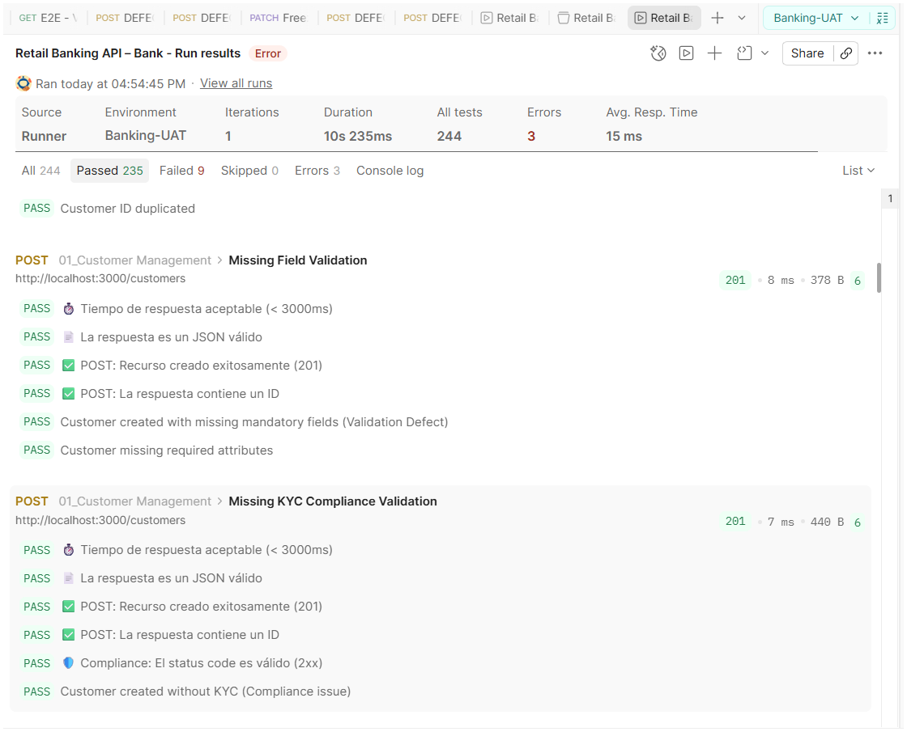

# 🏦 Postman Banking API - Test Suite

Suite de pruebas automatizadas para una API de Banca Minorista, desarrollada con **Postman** y enfocada en la validación de flujos críticos: gestión de clientes, cuentas, transferencias, compliance y casos negativos.

---

## 📋 Descripción

Este repositorio contiene una suite completa de pruebas de API que cubre:

- ✅ **Happy Path:** Creación de clientes, cuentas y transferencias exitosas.
- 🛡️ **Compliance:** Validación de límites diarios, cuentas congeladas y detección de fraudes (AML).
- ⚠️ **Casos Negativos:** Manejo de errores (campos faltantes, duplicados, saldos insuficientes).
- 🔄 **Flujos E2E:** Pruebas de extremo a extremo con preparación de datos.
- 🔒 **Idempotencia:** Prevención de transferencias duplicadas.

---

## 📂 Estructura del Proyecto
